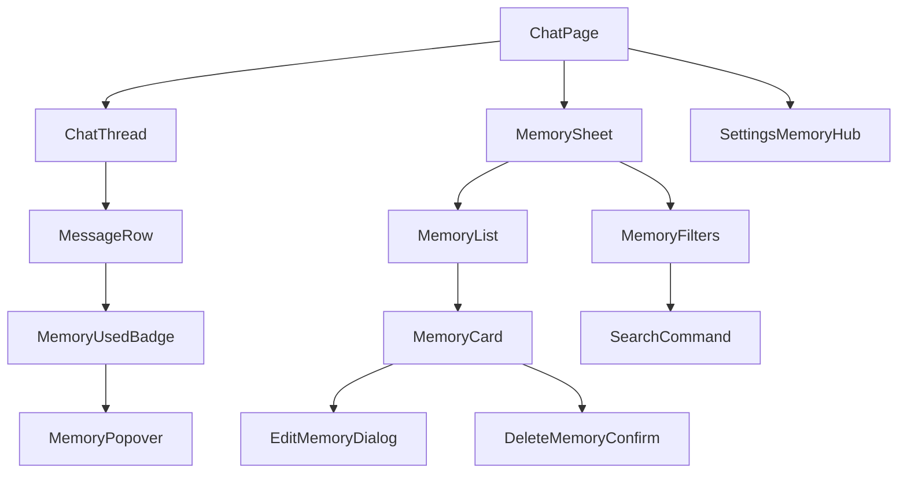
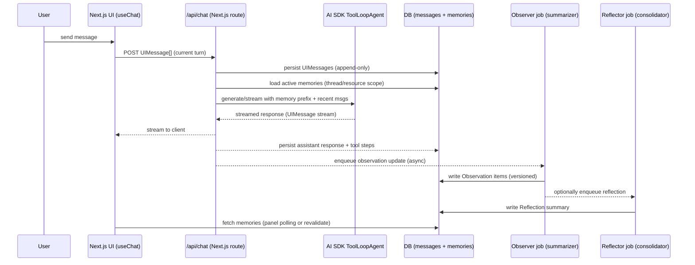

# UI/UX Patterns for Displaying LLM Agent Memories to End Users

## Executive summary

Long-term agent memory transforms an AI assistant from “stateless chatbot” into a personalized system that can carry goals, preferences, and prior work across sessions. The hard part is not only _building_ memory, but making it _legible, governable, and safe_ for end users—especially when you introduce observational memories (compressed, automatically-generated notes about what happened) rather than only explicit “save this” facts. Mastra’s Observational Memory (OM) is a notable example: it uses two background agents (Observer + Reflector) to maintain an append-only “observation log” that replaces raw history as conversations grow, keeping prompts stable and cacheable while maintaining long-horizon continuity. citeturn5view0turn5view1turn11search2

A usable memory UI typically needs three surfaces that work together:

- **A memory “control center”** (settings) for opt-in/out, scope (per-thread vs per-user), retention, export/delete, and policy-level capabilities; this maps closely to what major assistants and OS-level “memory” products expose (e.g., saved-memory toggles, temporary/incognito modes, delete-all, and per-item management). citeturn8view0turn8view2turn18view1turn19view1turn19view2
- **A contextual “memory inspector”** (drawer/panel in the chat) that explains what the agent knows _right now_, where it came from, and how to correct it without leaving the task. This directly supports explainability expectations: evidence, user-meaningful explanations, and clear limits. citeturn16view1turn17view0
- **Inline “memory moments”** (badges/annotations) that appear when memory is created/updated or used, keeping transparency lightweight and reducing the “hidden state” problem that harms trust. This pattern appears explicitly in ChatGPT’s “Memory updated → Manage” affordance and similar “manage saved memory” flows. citeturn8view0turn8view2

Implementation-wise, your project stack (Vercel AI SDK agent + Tailwind + shadcn + Next.js) is well-suited for this because the AI SDK treats `UIMessage` as the UI source-of-truth, supports typed message metadata, and exposes step-level tool-call traces—three foundations for building a user-facing memory inspector and provenance. citeturn20view1turn20view0turn4search10turn7search0

The key architectural recommendation for observational memories is to adopt an **eventually-consistent, append-first memory pipeline**: store raw conversation + tool events durably, generate observations asynchronously (or semi-async), and render memory in the UI as a _versioned, auditable artifact_ with per-item actions (edit/delete/disable/pin). This mirrors OM’s buffering/activation model and also aligns with privacy frameworks that emphasize transparency, user preference controls, provenance, and deletion workflows. citeturn5view0turn11search2turn17view0turn12search1

## Assumptions and scope

This report assumes no special constraints on user roles, scale, or retention policy (as requested). Where the right answer depends on those missing constraints (e.g., consumer vs enterprise, regulatory environment, multi-tenant RBAC, strict retention), I propose a “safe default” and call out alternatives.

Assumptions used throughout:

- **Memory scope**: you may support both per-thread memory and per-user memory (resource scope), because observational memory systems often need to span sessions to be valuable (Mastra supports both and marks resource scope as more complex). citeturn5view0turn11search5
- **Memory storage**: you can persist both raw messages and derived memory artifacts in a database; you may also store embeddings if you add semantic recall later. citeturn6view0turn6view2turn11search4
- **End-user visibility**: end users should be able to see, delete, and override memory items; an “admin-only” memory UI is a different product. This aligns with how mainstream products frame user control over memory and deletion. citeturn8view0turn8view2turn18view1turn19view1

## Definitions and taxonomy of memory types

Human memory concepts are useful as _design metaphors_ because they suggest different UI affordances: timelines for event-like memory, profile cards for stable facts, and scratchpads for short-term working context. In cognitive science, **episodic memory** is memory for personally experienced events tied to time/place, while **semantic memory** is organized general knowledge (facts, meanings) not bound to a specific episode—this distinction originates from the work of entity["people","Endel Tulving","memory psychologist"] and is preserved in modern definitions. citeturn3search0turn3search3turn3search12

**Working memory** is a limited-capacity system that both maintains and manipulates information “in mind,” classically modeled by entity["people","Alan Baddeley","psychologist working memory"] and entity["people","Graham Hitch","psychologist working memory"]; practical definitions frequently emphasize the “storage + processing” aspect, not just short-lived storage. citeturn3search1turn3search9turn3search10
A useful operational distinction is that working memory _includes_ short-term storage plus attentional control mechanisms, as argued by entity["people","Nelson Cowan","psychologist working memory"]. citeturn3search6

### A product-oriented taxonomy for agent memory

In agent systems, “memory” is usually an umbrella term for multiple _stores_ and _pipelines_:

- **Short-term / session memory**: the recent turn-by-turn message history needed for local conversational coherence; often bounded by a “last N messages” policy. Mastra explicitly describes “message history” as recent messages used both for UI rendering and short-term continuity. citeturn6view0turn11search3
- **Long-term semantic memory**: stable user facts/preferences/goals (“profile memory”). Mastra’s “working memory” is a persistent block (Markdown or structured schema) that the agent updates over time and can be resource-scoped (cross-thread) or thread-scoped. citeturn11search17turn6view1
- **Long-term episodic memory**: event-like records of what happened (“we decided X on date Y,” “we tried tool Z and it failed”). Many systems implement this as stored conversation logs, sometimes with retrieval. citeturn6view2turn10view2
- **Semantic recall (retrieval-based memory)**: vector search over past messages to retrieve relevant snippets. Mastra describes semantic recall as RAG-like similarity search against embedded messages and highlights the added latency/cost of embedding + vector DB queries. citeturn6view2turn6view0
- **Observational memory (compressed episodic memory)**: an automatically-maintained “dense observation log” that replaces raw history as it grows. Mastra’s OM uses two background agents (Observer + Reflector) to compress message history and tool results into an observation log; when observations grow too long, reflections condense them further into a three-tier system: recent messages → observations → reflections. citeturn5view0turn5view1

### What makes observational memory distinct

Most long-term memory systems change the prompt every turn by dynamically retrieving and injecting context. Mastra’s OM is designed so the **memory portion of the prompt is stable and append-only**, enabling prompt-prefix caching and predictable context windows (a core design goal and a key claim in Mastra’s benchmark write-up). citeturn5view0turn5view1

This distinction matters for UI/UX:

- With retrieval-based memory, the UI must explain _why these items were retrieved_ (search terms, similarity, ranking). citeturn6view2
- With observational memory, the UI must explain _what the agent observed/condensed and when_, and it must make clear that compression can introduce omissions or distortions—hence the importance of provenance, editability, and versioning. citeturn5view0turn16view1

## UX goals and evaluation criteria for memory interfaces

A memory UI is simultaneously a personalization feature and a governance surface. The design goals below align with established explainability and privacy principles.

### Transparency that stays meaningful

The entity["organization","NIST","us standards agency"] “Four Principles of Explainable AI” emphasize that explainable systems should (1) provide reasons/evidence, (2) be understandable to intended users, (3) reflect the real process accurately, and (4) communicate knowledge limits (only operate under designed conditions / sufficient confidence). citeturn16view1
Memory UI implications:

- Show **evidence/provenance** for memory items (source message/tool result/time range).
- Tailor explanation detail to user need (a lightweight “used memory” indicator first, deeper inspection on demand), to avoid explanation overload. citeturn16view1turn2search1
- Expose **knowledge limits** in UI copy: memory may be incomplete, stale, or wrong; provide “report incorrect memory” and fast correction affordances. citeturn16view1

### Control, editability, and predictable deletion

The entity["organization","NIST","us standards agency"] Privacy Framework core explicitly calls for mechanisms enabling data review/transfer/alteration/deletion and for communicating data processing purposes, risks, and preference options; it also calls out maintaining provenance/lineage and notifying individuals about privacy events. citeturn17view0
In end-user terms, “control” should mean:

- Memory can be **turned on/off** and scoped (per-thread vs per-user). citeturn8view1turn18view1turn5view0
- Users can **view, edit, delete** specific memories and **delete all**. citeturn8view0turn8view2turn18view1
- Users can start **temporary/incognito chats** that do not use or update memory (control without friction). citeturn8view0turn8view1turn19view1
- Deletion semantics must be explicit: several systems warn that deleting a “saved memory” may not remove the original conversation record unless that record is deleted as well—this expectation-setting is critical for trust. citeturn8view2turn18view1

### Trust calibration, privacy protection, and safety

Memory increases the risk surface:

- More stored personal data increases privacy impact; GDPR-style principles emphasize data minimization and storage limitation (keep only what’s necessary; don’t keep it longer than needed). citeturn12search1
- LLM applications face prompt-injection and data-exposure risks; the entity["organization","OWASP","open web application security project"] Top 10 for LLM apps highlights prompt injection as a primary risk category. citeturn2search2turn2search6

Memory UI should therefore support:

- **Consent and disclosure** (what is stored, why, and how to change it). citeturn17view0turn19view1
- **Sensitivity controls** (e.g., detect and avoid saving highly sensitive info by default unless explicitly requested—an approach described for ChatGPT). citeturn8view0turn19view0
- **Safer defaults** for observational memory: “observe less” unless users opt in; confirm when memory is updated; keep a “memory review queue” if your app is high-stakes. citeturn8view0turn17view0

## UI patterns and interaction flows

This section proposes concrete patterns you can mix-and-match. A strong memory experience usually uses 3–4 of these patterns together rather than betting on one.

### Comparison table of patterns

| UI pattern                                        | What it surfaces                                | Complexity | User benefit |  Dev effort | Risk (privacy / trust / misuse) |
| ------------------------------------------------- | ----------------------------------------------- | ---------: | -----------: | ----------: | ------------------------------: |
| Memory settings hub (toggles + manage)            | Global on/off, scope, retention, delete/export  |     Medium |         High |      Medium |                          Medium |
| In-chat memory drawer/panel                       | “What you know right now,” quick edit/delete    |     Medium |         High |      Medium |                          Medium |
| Inline “memory used / memory updated” annotations | Lightweight transparency at point-of-use        |     Medium |         High |      Medium |                      Low–Medium |
| Observational timeline (activity feed)            | Chronological observations, grouping, filters   |       High |  Medium–High |        High |                     Medium–High |
| Provenance linking (source jump)                  | Evidence and context: message/tool origin       |       High |         High |        High |                          Medium |
| Confidence/salience indicators + pinning          | What’s stable vs tentative; user prioritization |       High |       Medium | Medium–High |                          Medium |
| Diffs + version history (audit/rollback)          | “What changed,” restore prior versions          |       High |       Medium | Medium–High |                     Medium–High |
| Search + faceted filtering (memories)             | Cross-thread discoverability and cleanup        |     Medium |  Medium–High |      Medium |                          Medium |

The remaining subsections explain how these cohere into flows.

### Memory settings hub

**Best for:** transparency, consent, privacy controls, and deletion semantics.

**Core flow (recommended):**

1. User opens Settings → “Memory & Personalization.”
2. Two primary toggles: **Use memory in responses** and **Allow memory updates** (separating “read” from “write” reduces fear and supports progressive adoption). This mirrors industry patterns where users can disable memory/reference behavior. citeturn8view1turn18view1
3. “Manage memories” opens a list with search/sort, per-item delete, and delete-all. This is directly reflected in widely deployed memory UIs (manage dialog + search and per-item actions). citeturn8view0turn8view2turn18view1
4. “Temporary chat” (or “incognito”) toggle is visible and accessible from composer UI as well (not only in Settings), since users decide this _while writing_. citeturn8view0turn19view0

**Key UI content:** explain what memory stores (observations vs saved facts), where it comes from, and how to fully delete it (including the “you may need to delete the original conversation” caveat if you retain chat logs). citeturn8view2turn18view1turn12search1

### In-chat memory drawer or side panel

**Best for:** discoverability and editability during real work.

**Interaction model:** a non-blocking panel (right-side drawer on desktop; bottom sheet on mobile) that shows:

- “Pinned / Saved” (semantic) memories
- “Observations” (observational log)
- “Reflections / summaries” (compressed rollups)

This matches the three-tier approach used in Mastra’s OM design (recent messages, observations, reflections), but rendered for a human rather than for the model. citeturn5view0turn5view1

**Recommended micro-interactions:**

- Quick actions per memory card: Edit, Delete, “Don’t use,” Pin/Unpin, Mark sensitive.
- “Explain where this came from” expands provenance (source messages, tool name, timestamp). The NIST Privacy Framework calls out provenance/lineage access as part of privacy awareness. citeturn17view0turn16view1
- A “Memory health” strip at the top: last updated time, pending background processing, count by type, and storage usage (if you enforce limits).

### Inline annotations in the chat transcript

**Best for:** transparency with low cognitive overhead.

Two complementary inline patterns:

- **Memory-used marker** on assistant messages: e.g., a small “Memory” badge that opens a popover listing the memory items that influenced the response (or the “top 3” plus “view all”).
- **Memory-updated marker** after relevant turns: a toast or inline system message: “Memory updated” with a direct link to manage/review.

This mirrors the explicit “Memory updated → Manage memories” affordance described for ChatGPT’s UI. citeturn8view0turn8view2

For observational memory, also show **“observation pending”** when background summarization hasn’t completed. Mastra’s OM introduces async buffering and streaming/status events to avoid blocking while threads grow, reinforcing the UI value of a visible status indicator. citeturn11search2turn5view0

### Observational timeline (activity feed)

**Best for:** users who treat the agent as a long-running collaborator.

A timeline UI is essentially “episodic memory for humans.” The Microsoft Recall experience provides a strong reference for timeline browsing + search + filtering + deletion controls, including explicit opt-in and the ability to delete snapshots from search results. citeturn19view0turn19view1
You can apply the same structure to conversational observations:

- **Segments by time** (day/week)
- **Entry types** (decision, preference, task, fact, tool outcome)
- **Filter chips** (types, sources, “pinned only,” “sensitive hidden”)

This pattern is powerful but risks cognitive overload—so it’s best as an advanced view, not the default.

### Provenance badges and evidence links

Provenance is the difference between “creepy hidden profile” and “auditable assistant.”

At minimum, each memory item should display:

- Created time (and optionally last updated).
- Source type (user said / agent inferred / tool result).
- A stable link to the originating message(s) or tool call.

This supports explainability (“accompanying evidence”) and privacy expectations around lineage. citeturn16view1turn17view0turn4search10

### Confidence scores, salience, and “top of mind”

Be cautious with numeric “confidence” scores: users often interpret them as calibrated probabilities, while LLM-derived scores are typically heuristics. A safer UI approach is:

- Use **ordinal labels** (“High / Medium / Low support”) derived from transparent signals: explicitness (“user explicitly said”), repetition, recency, cross-source corroboration.
- Provide **salience controls**: Pin/Unpin, “Deprioritize,” and automatic “top-of-mind” demotion.

ChatGPT describes automatic memory management where recency and frequency influence which memories remain prioritized (“top of mind”), and it exposes a UI distinction (grayed vs active) plus history/restore. citeturn8view2turn16view1

### Diffs and version history

Versioning is especially important for observational memory because compression can be wrong, and “fixing memory” often means _editing a derived artifact_, not deleting raw chat logs.

A robust pattern:

- Every edit creates a new version (append-only).
- Users can view history and restore prior versions (like a “memory changelog”).

This pattern is explicitly supported in ChatGPT’s memory UX (“view and restore prior versions”). citeturn8view2

### Search, filters, and summaries

Search is critical once you have more than ~20 memory items. At minimum:

- Full-text search over memory text.
- Facets by type, scope, recency, and sensitivity.

For observational timelines, add **summaries** at multiple granularities (“This week’s key observations”), but make the summary expandable into underlying items to avoid “opaque condensation,” a known trust failure mode in AI product experiences. citeturn16view1turn2search1

## Examples and lessons from existing systems

### Mastra observational memory as a design reference

Mastra’s Observational Memory (OM) is defined as a long-context agent memory system where background agents maintain a dense observation log that replaces raw history, explicitly aiming to keep the context window small while preserving long-term continuity. citeturn5view0turn6view0

Notable behaviors that should shape UI design:

- **Three-tier model:** recent messages, observations, reflections. citeturn5view0
- **Thresholded compression:** Observer runs when message tokens exceed a threshold; compression can be large (documented as ~5–40×). citeturn5view0
- **Background buffering and non-blocking updates:** OM can precompute observations/reflections and “activate” them when needed; async buffering is described as default-on in recent releases. citeturn11search2turn5view0
- **Stable, cacheable prompt prefix:** a central benefit cited in both docs and the LongMemEval write-up, with a “stable context window” rather than per-turn dynamic retrieval. citeturn5view0turn5view1

For end-user UI, these imply:

- Provide a visible “Memory updated / reflecting” status (since updates may be delayed).
- Expose reflections as _derived summaries_ with easy drill-down to the underlying observation items.

### Consumer assistant memory controls (OpenAI / ChatGPT)

entity["company","OpenAI","ai research company"] describes memory controls including: the ability to view/delete specific memories, clear all memories, turn memory off, and use Temporary Chat that doesn’t use or update memory; it also states that memories are not necessarily linked to specific conversations and that deleting a chat does not delete saved memories. citeturn8view0turn8view2

UI lessons:

- The “**Memory updated**” notifier with an immediate “Manage memories” path reduces the “silent profile” problem. citeturn8view0
- Saved-memory management benefits from **search/sort**, per-item actions, and a visible **version history**. citeturn8view2
- Deletion semantics must be explicit; ChatGPT notes a 30-day retention of logs of deleted memories for safety/debugging, a detail that can matter for user trust in deletion. citeturn8view2

### Google Gemini memory and personalization controls

entity["company","Google","internet services company"] describes Gemini recalling past chats, emphasizes user control over stored information (review/delete/retention length), and notes that Gemini may indicate when it uses past chats in sources/related content. citeturn18view0

For enterprise, Google Cloud documentation lays out a detailed “Settings > Personalization” model with:

- Toggles for conversation history learning and connected data sources
- Separate toggles for referencing saved memories
- A “Manage saved memories” dialog with delete-all and per-item delete
- A statement that changes to connected data sources may take up to 24 hours to take effect
- A warning that fully removing memory may require deleting the original conversation too citeturn18view1

UI lessons:

- Separate “connected sources” controls from “saved memory” controls when memory draws from multiple inputs.
- Communicate **latency/propagation** for memory updates as first-class UI state. citeturn18view1

### Memory as files and policies (Anthropic Claude Code)

entity["company","Anthropic","ai safety company"]’s Claude Code docs present two persistent memory types: automatic memory and user-authored `CLAUDE.md` files, loaded into context at session start (with auto memory loading only the first 200 lines of its main file) and organized in a hierarchy (org-wide policy, project memory, modular rules). citeturn9view1

UI lessons:

- A “memory as documents” model maps well to developer audiences and supports diffing/version control workflows.
- It also suggests a strong pattern for enterprise: separate **admin-managed policy memory** (immutable to users) from user-editable preference memory.

### Letta Code: explicit memory commands and versioned memory stores

entity["organization","Letta","agent memory platform"] describes a workflow where memory can be explicitly triggered (`/remember`), reviewed (`/memory`), and consolidated via reflection subagents, with memory organized into a git-backed directory of markdown files (MemFS) enabling rollbacks and changelogs. citeturn9view2

UI lessons:

- “Remember this” is a powerful interaction primitive; add it as an action on messages and in the memory panel (not only as a prompt convention).
- Versioned storage and rollbacks are not just “dev features”—they are the user-friendly way to repair memory drift.

### Microsoft Recall: opt-in observational “timeline” memory at OS scale

entity["company","Microsoft","software company"]’s Recall is an opt-in experience that stores snapshots locally, provides timeline browsing, search, filtering, pausing, and deletion controls, and emphasizes user choice and consent (including enterprise policies that cannot force saving snapshots for users). citeturn19view0turn19view1turn19view2

UI lessons for agent observational memory:

- Timeline UIs create high perceived value—but demand strong consent, filtering, and deletion affordances because the “observed” data can be sensitive.
- “Pause until tomorrow,” “filter apps/sites,” and “delete all from this source” inspire conversational equivalents: pause memory updates, exclude certain tools/domains, and bulk-delete memories derived from a tool or thread. citeturn19view0turn19view1

image_group{"layout":"carousel","aspect_ratio":"16:9","query":["ChatGPT manage memories settings dialog screenshot","Google Gemini Enterprise personalization memory settings screenshot","Microsoft Recall timeline search UI screenshot","Claude Code CLAUDE.md memory file screenshot"],"num_per_query":1}

## Implementation guidance for Tailwind + shadcn + Next.js with a Vercel AI SDK agent

### Reference architecture

Your implementation needs two parallel data planes:

1. **Conversation plane** (UI messages + tool events): what the user saw and what happened.
2. **Memory plane** (observations + reflections + pinned facts): derived, editable artifacts.

The Vercel AI SDK already pushes you toward a clean separation where `UIMessage` is the UI state source-of-truth, while `ModelMessage` is what is sent to the model. citeturn20view1turn4search11
Leverage that separation: persist `UIMessage` for auditability, but keep memory artifacts in their own tables/collections.

#### Mermaid: component interaction sketch



#### Mermaid: memory data flow



### Data model for observational memories

A pragmatic schema that supports provenance, editing, and versioning:

- **Observation**: an atomic item (1–3 sentences) capturing a fact, preference, decision, task state, tool outcome, or hazard.
- **Reflection**: a higher-level consolidation summarizing multiple observations (often per week/month or per topic).
- **Memory policy metadata**: sensitivity, consent, scope, salience.

Minimal TypeScript + Zod sketch:

```ts
import { z } from 'zod';

export const memoryScopeSchema = z.enum(['thread', 'resource']);

export const observationSchema = z.object({
  id: z.string(),
  scope: memoryScopeSchema,
  threadId: z.string(),
  resourceId: z.string().optional(),

  kind: z.enum([
    'fact',
    'preference',
    'decision',
    'goal',
    'task_state',
    'tool_outcome',
    'warning',
  ]),

  text: z.string().min(1),

  createdAt: z.string(), // ISO
  updatedAt: z.string().optional(),

  // Provenance for trust and debugging
  provenance: z
    .object({
      source: z.enum(['user', 'assistant', 'tool', 'system']),
      messageIds: z.array(z.string()).optional(),
      toolName: z.string().optional(),
      toolCallId: z.string().optional(),
      timeRange: z.object({ start: z.string(), end: z.string() }).optional(),
    })
    .optional(),

  // Heuristics, not probabilities
  support: z.enum(['low', 'medium', 'high']).default('medium'),
  salience: z.number().min(0).max(1).default(0.5),

  sensitivity: z.enum(['normal', 'personal', 'sensitive']).default('normal'),

  status: z.enum(['active', 'archived', 'deleted']).default('active'),

  // Versioning
  version: z.number().int().min(1).default(1),
  previousVersionId: z.string().optional(),
});

export type Observation = z.infer<typeof observationSchema>;
```

Why this model matches observational memory UX:

- **Append-first + version chain** supports “view history / restore” patterns. citeturn8view2
- **Provenance** supports explainability and privacy lineage expectations. citeturn16view1turn17view0
- **Scope** maps to thread vs resource modes described in Mastra’s OM and working memory systems. citeturn5view0turn11search17

### API contracts (Next.js route handlers)

Use cursor pagination to support long observation logs.

Suggested endpoints:

- `GET /api/memories?scope=thread&threadId=...&cursor=...&limit=...&kind=...&q=...`
- `POST /api/memories` (create a pinned/saved memory item)
- `PATCH /api/memories/:id` (edit → creates new version, soft-deprecates old)
- `DELETE /api/memories/:id` (soft delete; optionally hard-delete later)
- `POST /api/memories/bulk-delete` (by thread, by tool, by time range)
- `POST /api/memory-policy` (toggle read/write/temporary chat flags)

Cursor shape:

```ts
type Cursor = { createdAt: string; id: string };
```

Response shape:

```ts
type Page<T> = { items: T[]; nextCursor?: Cursor; totalApprox?: number };
```

### Integrating with Vercel AI SDK: capturing events and attaching memory metadata

Key lever points:

- AI SDK supports **agents** (`ToolLoopAgent`) and step-level tool execution data. citeturn7search0turn4search10
- `UIMessage` is the UI source-of-truth and can include custom metadata. citeturn20view1turn20view0
- Rendering should use message `parts` (text/tool invocations/results) rather than `content` for richer UIs. citeturn7search2turn7search32

Practical pattern:

1. On the server, when handling `/api/chat`:
   - Load active memories for the thread/resource scope.
   - Inject them into the model context as a stable “memory prefix” (system or developer message).
   - Track which memory IDs were included.
2. In `onFinish`, persist:
   - Full `UIMessage[]` (conversation)
   - Tool steps (for provenance)
   - Assistant response metadata: `{ usedMemoryIds, memoryScope, memoryVersionSnapshot }`
3. Trigger observation update:
   - Use a background job (preferred) or a non-blocking async task to generate new observations from the latest conversation slice.

You can stream message metadata (timestamps, model info, token counts, and also “memory status”) using AI SDK message metadata patterns. citeturn20view0turn20view2

### Mapping UI elements to Tailwind + shadcn components

Below is a pragmatic component mapping that aligns with common memory UI patterns (and keeps accessibility sane by building on Radix primitives):

- **Memory panel**: `Sheet` for a right-side drawer (“Memory”) on desktop; use the same component in “bottom” mode for mobile. citeturn4search12
- **Manage memories modal**: `Dialog` with a table/list and destructive actions; Radix Dialog provides focus trapping and ARIA semantics by default. citeturn4search15turn13search2
- **Memory list**: `Data Table` guide (TanStack Table) or simple `Table` for MVP; add sorting/filtering/pagination as memory grows. citeturn4search1
- **Search + quick actions**: `Command` (cmdk-based) for in-panel search and actions like “pin,” “delete,” “exclude tool,” “jump to source.” citeturn21search0
- **Categories**: `Tabs` for “Saved,” “Observations,” “Reflections,” “Excluded.” citeturn21search1
- **Row actions**: `Dropdown Menu` for per-item actions (edit/delete/pin/history). citeturn21search6
- **Details disclosure**: `Collapsible` or `Accordion` for provenance expansion and version history. citeturn21search7turn21search3
- **Inline memory signals**: `Badge` + `Tooltip` for “Used memory,” “Updated,” “Sensitive,” “Pinned.” citeturn21search22turn21search31
- **Notifications**: `Sonner` for “Memory updated,” “Memory deleted,” “Temporary chat enabled.” (shadcn notes Toast is deprecated in favor of Sonner.) citeturn21search2turn21search26

### State management and consistency

Observational memory is rarely strictly synchronous (Mastra explicitly supports non-blocking background work and buffering). citeturn11search2turn5view0
Therefore design for eventual consistency:

- Always show **“last updated”** timestamp in the memory panel.
- Show a **pending state** after each assistant response (“Updating memory…”), then resolve once observations are written.
- Use “version snapshot” semantics: when generating a response, store which memory version set the agent used, so the UI can reconcile “this answer used memory v42” even if the memory has already advanced.

Pagination/performance:

- Cursor paginate observations; avoid loading entire logs into the client.
- Consider client-side virtualization once rows exceed ~200; keep row height consistent for performance.
- Precompute reflections (daily/weekly) so the timeline view is not an O(n) scroll of raw events.

## Accessibility, localization, security/privacy, and a prioritized roadmap

### Accessibility requirements and practices

WCAG 2.2 adds success criteria that are especially relevant to complex panels and data-heavy UIs (focus not obscured, target size, dragging movements, consistent help, accessible authentication). citeturn2search3turn2search7

Implementation guidance:

- Use dialog/drawer primitives with correct focus management. Radix Dialog supports modal/non-modal patterns and traps focus when modal. citeturn13search2turn13search6
- For searchable lists and filters, follow WAI-ARIA Authoring Practices patterns (e.g., combobox behaviors that preserve previous selection on Escape). citeturn13search29turn13search1
- Respect reduced-motion preferences; Tailwind supports `motion-reduce` / `motion-safe`, and the underlying `prefers-reduced-motion` media query is the standards-based hook. citeturn13search11turn13search7turn13search31

### Localization and internationalization

Even if your initial launch is en-US, memory UIs quickly become i18n-heavy because they include timestamps, relative dates, and user-generated text. The W3C distinguishes internationalization (designing so the product can adapt) from localization (adapting to a locale). citeturn13search20
At minimum:

- Locale-aware date/time formatting and relative time.
- Avoid concatenating strings around user content (to support grammatical order in other languages).
- Ensure search/filter labels are translatable and that memory “kind” values map to localized display labels.

If you support server-driven localization, W3C guidance on language negotiation clarifies that HTTP `Accept-Language` negotiation is different from IP-based guessing and should be applied deliberately. citeturn13search12

### Security and privacy best practices, including consent flows

#### Consent flows (recommended defaults)

Borrow the best “user choice from the start” practices seen in high-sensitivity memory systems:

- **Opt-in by default for observational memory updates**, especially if you infer preferences automatically. Microsoft Recall explicitly requires opt-in to start saving snapshots, and enterprise policy cannot force users to save. citeturn19view0turn19view2
- Provide a **temporary chat** mode that neither uses nor updates memory, surfaced near message composition. citeturn8view0turn19view1
- Show **event notifications** when memory updates occur, with one-click review/manage. citeturn8view0turn17view0
- Offer **source-level exclusions** (“Don’t learn from this thread/tool/source”), inspired by Recall’s ability to filter apps/websites and Gemini Enterprise’s ability to disconnect data sources (with communicated delay). citeturn19view0turn18view1

#### Data minimization, retention, and deletion semantics

GDPR Article 5 principles highlight transparency, data minimization, accuracy, and storage limitation. citeturn12search1
Concrete UX implications:

- Set and display retention periods (e.g., “Observations older than 180 days are archived unless pinned”).
- Make “delete memory” vs “delete conversation” differences explicit; both OpenAI and Google’s enterprise docs warn that to fully remove a memory you may need to delete the originating conversation. citeturn8view2turn18view1

#### Application and LLM-specific security

- Use HTTPS for all memory APIs and protect them with strong authn/z and least privilege (OWASP REST Security guidance). citeturn12search6
- Encrypt sensitive memory at rest and manage keys appropriately (OWASP Cryptographic Storage guidance). citeturn12search2
- Treat memory content as **untrusted input**. Prompt injection is a top risk category for LLM apps, and memory amplification is a common failure mode (“the app saved the attacker’s instruction as a ‘preference’”). citeturn2search2turn2search6

Mitigations that connect directly to UI:

- Require explicit user confirmation for memory writes of certain classes (“financial,” “medical,” “authentication,” “instructions that change safety posture”).
- Provide a visible “sensitive” label and allow users to mark items as “never use” (kept for audit but excluded from prompts).
- Log and show memory provenance so users can detect malicious or incorrect entries.

### Prioritized feature roadmap

A practical, phased plan for your stack:

**Milestone: MVP (ships value fast, low risk)**

- Memory settings hub: “Use memory” + “Update memory” toggles; temporary chat mode; basic manage list (view + delete). citeturn8view1turn8view0turn19view1
- In-chat Memory Sheet (read-only): show “Saved” and “Observations,” with timestamps and basic filters.
- Provenance minimal: show createdAt + source type.
- Server persistence: store `UIMessage[]` as your conversation truth and store Observation items separately. citeturn20view1turn10view1

**Milestone: Trust and control (makes memory feel safe)**

- Inline “memory updated” toast + “manage” deep link. citeturn8view0turn21search2
- Edit memory (creates a new version) + view history (basic).
- Memory-used badge on assistant responses (list of memory IDs used).
- Source jump (“view originating message/tool result”).

**Milestone: Observational power features (for heavy users)**

- Observational timeline view (segmented, filterable).
- Reflections (weekly/monthly rollups) with drill-down.
- Source exclusions (thread/tool/source) + bulk delete by source. citeturn19view0turn18view1

**Milestone: Governance and enterprise-ready**

- Role separation: admin-managed policy memory vs user memory (inspired by hierarchical `CLAUDE.md` / org policies). citeturn9view1
- Export/import memory, retention schedules, and audit reporting aligned with privacy framework principles (preference handling, deletion workflows, provenance). citeturn17view0turn12search1

### Final trade-off recap

- **Cognitive load vs transparency**: Inline micro-signals plus layered drill-down aligns with explainability principles while avoiding overload. citeturn16view1turn2search1
- **Privacy vs personalization**: Opt-in, temporary chats, and granular deletion/exclusion are non-negotiable for observational memory because it can feel invasive if hidden. citeturn19view1turn8view0turn12search1
- **Latency vs freshness**: Asynchronous observation/reflection pipelines reduce blocking and cost (Mastra’s OM buffering rationale), but require explicit UI status and eventual-consistency handling. citeturn11search2turn5view0
- **Storage vs auditability**: Keeping raw messages + derived memories enables provenance and repairability, but increases storage and requires clear retention policies and deletion semantics. citeturn18view1turn8view2turn12search1
